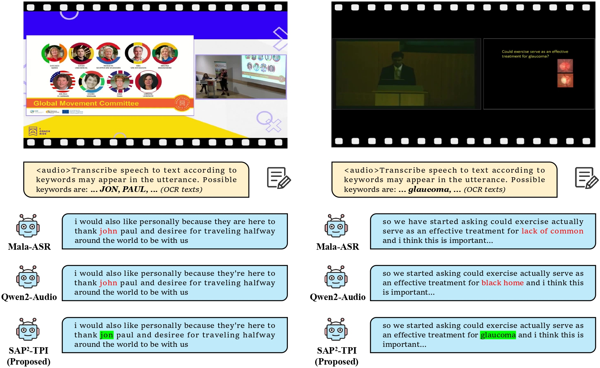
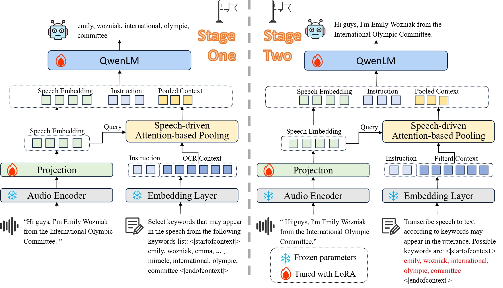

# SAP²-ASR: Speech-Aware Long Context Pruning and Integration for Contextualized Automatic Speech Recognition

> **Note**: This repository is a fork of [ms-swift](https://github.com/modelscope/ms-swift) that implements the SAP² (Speech-Aware Context Pruning with Speech-Driven Attention-based Pooling) method for contextualized automatic speech recognition, as described in our [paper](https://www.arxiv.org/pdf/2511.11139).

<p align="center">
    <br>
    
    <br>
<p>
<p align="center">
<a href="https://www.arxiv.org/pdf/2511.11139">Paper</a> &nbsp ｜ &nbsp <a href="https://github.com/jymh/SAP2-ASR">Original Code</a> 
<br>
        <a href="README_CN.md">中文</a> &nbsp ｜ &nbsp English &nbsp
</p>

<p align="center">


<a href="https://github.com/modelscope/swift/blob/main/LICENSE"></a>
</p>

## 📖 Table of Contents
- [Introduction](#-introduction)
- [Installation](#%EF%B8%8F-installation)
- [Datasets](#-datasets)
- [Quick Start](#-quick-start)
- [Usage](#-usage)
- [Model Architecture](#-model-architecture)
- [Citation](#-citation)
- [License](#-license)

## 📝 Introduction

**SAP² (Speech-Aware Context Pruning with Speech-Driven Attention-based Pooling)** is a novel framework for contextualized automatic speech recognition (ASR) that dynamically prunes and integrates relevant contextual keywords. This method addresses the challenge of leveraging long-context information in domain-specific scenarios (e.g., conference presentations) where extensive OCR-derived textual contexts contain both relevant information and considerable noise.

### Key Features

- **Speech-Aware Context Pruning**: Dynamically filters OCR-derived textual contexts to retain only keywords directly relevant to speech content
- **Cross-Modal Context Compression**: Uses Speech-Driven Attention-based Pooling to compress extensive textual inputs into concise, speech-relevant context embeddings
- **State-of-the-Art Performance**: Achieves WER of 7.71% on SlideSpeech and 1.12% on LibriSpeech, with a 41.1% relative improvement in biased keyword recognition over non-contextual baselines

### Experimental Results

- **SlideSpeech**: WER 7.71%, B-WER improvement of 41.1% over baseline
- **LibriSpeech**: WER 1.12%
- **Robust scalability** under extensive contextual input conditions

### Recognition Examples

The following figure shows recognition examples comparing SAP² with previous methods on the SlideSpeech test set. Red texts indicate recognition errors in proper nouns, while green-highlighted texts showcase corrections made by SAP².

<p align="center">
  
</p>

## 🛠️ Installation

This project is based on [ms-swift](https://github.com/modelscope/ms-swift). To install:

```shell
# Clone the repository
git clone https://github.com/jymh/SAP2-ASR.git
cd SAP2-ASR

# Create conda environment
conda env create -f environment.yml

# Activate the environment
conda activate swift

# Install the package
pip install -e .
```

**Requirements:**
- Python >= 3.10
- PyTorch >= 2.0
- transformers >= 4.45
- librosa (for audio processing)

## 📊 Datasets

This project uses two datasets for training and evaluation: **SlideSpeech** and **LibriSpeech**. Both datasets can be found on OpenSLR, or you can download them from the following sources:

### SlideSpeech

SlideSpeech is a large-scale audio-visual corpus enriched with slides, containing 1,705 videos with 1,000+ hours of audio, including 473 hours of high-quality transcribed speech.

**Download Options:**
1. **GitHub Repository**: Clone the official download scripts from [https://github.com/Mashiro009/slidespeech_dl.git](https://github.com/Mashiro009/slidespeech_dl.git)
   ```shell
   git clone https://github.com/Mashiro009/slidespeech_dl.git
   cd slidespeech_dl
   bash run.sh
   ```

2. **OpenSLR**: Available on OpenSLR website

**Dataset Details:**
- Website: [https://slidespeech.github.io/](https://slidespeech.github.io/)
- Contains synchronized slides with OCR-derived textual contexts
- Suitable for contextualized ASR evaluation

### LibriSpeech

LibriSpeech is a large-scale corpus of read English speech, derived from audiobooks in the LibriVox project.

**Download Options:**
1. **Hugging Face Datasets**: Load directly using the Hugging Face datasets library
   ```python
   from datasets import load_dataset
   dataset = load_dataset("openslr/librispeech_asr")
   ```
   Or visit: [https://huggingface.co/datasets/openslr/librispeech_asr](https://huggingface.co/datasets/openslr/librispeech_asr)

2. **OpenSLR**: Available on OpenSLR website

**Dataset Details:**
- Contains approximately 1000 hours of 16kHz read English speech
- Split into training (train-clean, train-other), validation, and test sets
- Widely used benchmark for ASR systems

**Note**: For LibriSpeech, we follow the approach in the paper to dynamically construct biasing lists for training and validation sets, using words outside the common5k vocabulary with randomly selected distractors.

### Preprocessed Dataset Metadata

We provide preprocessed dataset metadata on Hugging Face containing training data with contextual keywords formatted for SAP². The metadata includes 1.09M training samples from both SlideSpeech and LibriSpeech datasets.

**Hugging Face Dataset**: [https://huggingface.co/datasets/jymh/SAP2-ASR](https://huggingface.co/datasets/jymh/SAP2-ASR)

## 🚀 Quick Start

### Training SAP² Model with SAP (Speech-driven Attention-based Pooling)

This example shows how to train the SAP² model with SAP pooling on SlideSpeech dataset:

```shell
# Multi-GPU training with SAP compression
NPROC_PER_NODE=8 CUDA_VISIBLE_DEVICES=0,1,2,3,4,5,6,7 swift sft \
    --model "/path/to/qwen2-audio-instruct" \
    --model_type sap_qwen2_audio \
    --dataset "/path/to/slidespeech/train.json" \
    --val_dataset "/path/to/slidespeech/dev.json" \
    --save_steps 1000 \
    --save_total_limit 2 \
    --num_train_epochs 1 \
    --per_device_train_batch_size 32 \
    --per_device_eval_batch_size 32 \
    --max_length 4096 \
    --output_dir "/path/to/output" \
    --train_type lora \
    --freeze_llm false \
    --freeze_vit true \
    --freeze_aligner false \
    --lora_rank 8 \
    --sap_window_size 2 \
    --compressor_hidden_size 4096 \
    --num_attention_heads 4 \
    --deepspeed zero2
```

**Key Parameters:**
- `--model_type sap_qwen2_audio`: Use the SAP-enabled Qwen2-Audio model
- `--sap_window_size 2`: Window size for speech-driven attention-based pooling
- `--compressor_hidden_size 4096`: Hidden size of the compressor
- `--num_attention_heads 4`: Number of attention heads for pooling

### Inference with SAP² Model

After training, perform inference with the trained model:

```shell
CUDA_VISIBLE_DEVICES=0 swift infer \
    --adapters /path/to/checkpoint-xxx \
    --infer_backend pt \
    --temperature 0 \
    --max_batch_size 4 \
    --val_dataset /path/to/test.json \
    --result_path /path/to/result.jsonl \
    --stream false \
    --sap_window_size 2 \
    --compressor_hidden_size 4096 \
    --num_attention_heads 4
```

## ✨ Usage

### Data Preparation

The SAP² method requires contextual keywords (e.g., from OCR text) to be formatted with special tokens `<|startofcontext|>` and `<|endofcontext|>`. Example data format:

```json
{
  "messages": [
    {
      "role": "user",
      "content": "<audio>/path/to/audio.wav</audio>Transcribe speech to text according to keywords may appear in the utterance. Possible keywords are: <|startofcontext|>keyword1 keyword2 keyword3<|endofcontext|>"
    },
    {
      "role": "assistant",
      "content": "transcribed text"
    }
  ],
  "audios": "/path/to/audio.wav"
}
```

You can use `extract_predicted_keywords.py` to process your data and add contextual keywords.

### Training with SAP Compression

The SAP (Speech-driven Attention-based Pooling) mechanism compresses long contextual keywords using speech-driven attention-based pooling:

```shell
swift sft \
    --model_type sap_qwen2_audio \
    --model "/path/to/qwen2-audio-instruct" \
    --dataset "/path/to/dataset" \
    --train_type lora \
    --sap_window_size 2 \
    --compressor_hidden_size 4096 \
    --num_attention_heads 4 \
    ...
```

### Evaluation

After inference, you can evaluate the results using the provided evaluation script:

```shell
python evaluate_slidespeech_process.py --input_file /path/to/result.jsonl
```

## 🏗️ Model Architecture

The following figure illustrates the overall architecture of SAP²:

<p align="center">
  
</p>

The core implementation is in `swift/llm/model/sqp_models/modeling_sqp_qwen2audio.py`, which extends `Qwen2AudioForConditionalGeneration` with:

- **`Qwen2AudioSAPPoolingLayer`**: Implements SAP (Speech-driven Attention-based Pooling) that compresses contextual keywords based on speech features
- **`SAP2Qwen2AudioForConditionalGeneration`**: Main model class that integrates SAP compression into the Qwen2-Audio architecture

The SAP pooling layer uses cross-modal attention between speech embeddings and context embeddings to compute pooling weights, enabling efficient compression of long contextual inputs while preserving speech-relevant information.

## 📎 Citation

If you use SAP² in your research, please cite our paper:

```bibtex
@article{rong2025speechaware,
  title={Speech-Aware Long Context Pruning and Integration for Contextualized Automatic Speech Recognition},
  author={Rong, Yiming and Zhang, Yixin and Wang, Ziyi and Jiang, Deyang and Zhao, Yunlong and Wu, Haoran and Zhou, Shiyu and Xu, Bo},
  journal={arXiv preprint arXiv:2511.11139},
  year={2025}
}
```


## 🏛 License

This framework is licensed under the [Apache License (Version 2.0)](https://github.com/modelscope/modelscope/blob/master/LICENSE). For models and datasets, please refer to the original resource page and follow the corresponding License.
